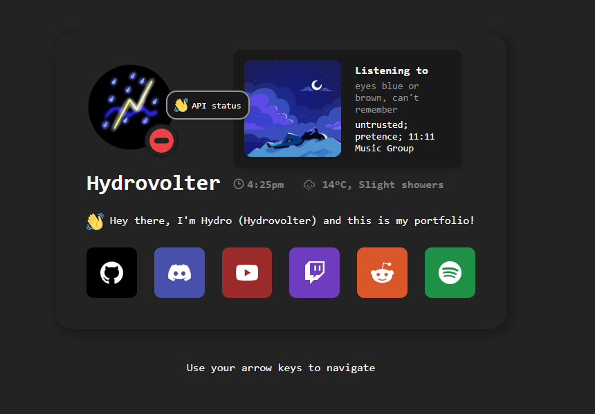

# Discord Presence API

API for [my portfolio site](https://hydrovolter.com) which provides a simple interface for fetching my user status and presence.

## Features

* Retrieve online status (online, idle, dnd, offline).
* Get activity details (game, streaming, custom status).
* Fetch user's platform (desktop, mobile, web).
* Showcases VSCode workspace information

## API Endpoint

The API is accessible at: [status.hydrovolter.com](https://status.hydrovolter.com)